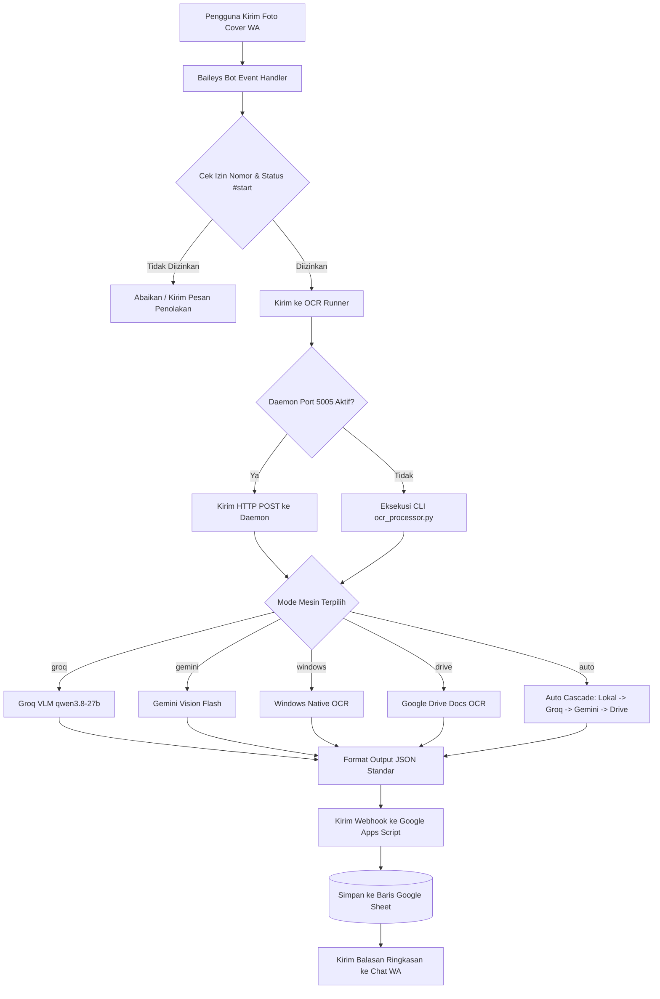

<div align="center">

# 📖 WScaner

### Automated WhatsApp OCR Scanner to Google Sheets

<p align="center">
  <a href="https://nodejs.org/"></a>&nbsp;
  <a href="https://www.python.org/"></a>&nbsp;
  <a href="https://github.com/WhiskeySockets/Baileys"></a>&nbsp;
  <a href="https://groq.com/"></a>&nbsp;
  <a href="https://ai.google.dev/"></a>&nbsp;
  <a href="https://podman.io/"></a>
</p>

Bot WhatsApp otomatis & cerdas untuk memindai foto majalah/buletin dakwah **Ulul Albab - Cerdas dan Mencerahkan**, mengekstrak metadata cover (*Edisi*, *Tahun Romawi*, *Tanggal*), 3 Judul Artikel, Penulis, serta Surah menggunakan OCR berkecepatan tinggi, lalu menyimpannya langsung ke **Google Sheet**.

</div>

---

## 📑 Daftar Isi

- [🌟 Fitur Utama](#-fitur-utama)
- [🔄 Alur Pemrosesan (Workflow)](#-alur-pemrosesan-workflow)
- [⚡ Perbandingan 5 Mesin OCR](#-perbandingan-5-mesin-ocr)
- [📁 Struktur Proyek (Max 4-Folder)](#-struktur-proyek-max-4-folder)
- [⚙️ Variabel Lingkungan (`.env`)](#️-variabel-lingkungan-env)
- [🚀 Cara Menjalankan](#-cara-menjalankan)
- [💬 Perintah WhatsApp Bot](#-perintah-whatsapp-bot)
- [☁️ Integrasi Google Apps Script (Clasp)](#️-integrasi-google-apps-script-clasp)
- [🧪 Pengujian & Benchmarking](#-pengujian--benchmarking)

---

## 🌟 Fitur Utama

- **Arsitektur 4-Folder Bersih (`src/`, `data/`, `runtime/`, `scripts/`)**  
  Struktur modular dengan nesting folder maksimal 2 lapis. Sesi login WhatsApp di `runtime/auth/` terisolasi dan tidak perlu scan ulang QR saat restrukturisasi.
- **5 Pilihan Mesin OCR Fleksibel**  
  Mendukung Groq Cloud VLM, Google Gemini Vision, Windows Native OCR, Google Drive Native OCR, dan mode Auto/Hybrid.
- **Persistent OCR Daemon (Port 5005)**  
  Background worker Python yang siap melayani request pemindaian seketika, mengeliminasi overhead inisialisasi runtime Python.
- **Onetimeused Photo Extractor**  
  Mampu menangkap foto sekali lihat (*view-once media*) yang dikirim pengguna dan menyimpannya secara rapi ke `data/downloads/`.
- **Penyimpanan Otomatis 9 Kolom Google Sheets**  
  Format tabel rapi dengan mekanisme pencegahan duplikasi data berdasarkan kombinasi Edisi, Tahun, dan Tanggal.
- **Role-Based WhatsApp Commands**  
  Hak akses terpisah antara administrator IT dan pengguna umum untuk operasional bot yang aman.
- **Live Camera Auto-Scanner (`camera.bat` / `npm run camera`)**  
  Fitur pemindaian webcam langsung real-time dengan pendeteksi stabilitas otomatis (*motion-settling trigger*), HUD modern dengan panduan kotak cover majalah, pencegahan duplikasi cerdas (riwayat 20 pindaian terakhir di `runtime/camera_scan_history.json`), dan sinkronisasi otomatis ke Google Sheets & Drive di background.

---

## 🔄 Alur Pemrosesan (Workflow)



---

## ⚡ Perbandingan 5 Mesin OCR

| Peringkat | Mesin / Model                                    | Kecepatan Rata-rata | Akurasi Majalah |  Konsumsi RAM Laptop   |       Kuota / Biaya        |     Mode Offline      |
| :-------: | :----------------------------------------------- | :-----------------: | :-------------: | :--------------------: | :------------------------: | :-------------------: |
| 🥇 **#1** | **Groq Cloud VLM (`qwen/qwen3.8-27b`)**          |   **~1.2 detik**    |    **100%**     |  **0 MB** (Cloud LPU)  |    Gratis (7k token/m)     |         Tidak         |
| 🥈 **#2** | **Google Gemini Vision (`gemini-flash-latest`)** |     ~2.1 detik      |    **100%**     |  **0 MB** (Cloud AI)   | Gratis (15 RPM / 1.5k RPD) |         Tidak         |
| 🥉 **#3** | **Windows Native OCR (`Windows.Media.Ocr`)**     |   **~0.3 detik**    |      ~85%       | **~15 MB** (Native C#) |        Tak Terbatas        | **Ya (100% Offline)** |
|  **#4**   | **Google Drive Native OCR (Google Docs)**        |     ~3.5 detik      |      ~80%       | **0 MB** (Cloud Docs)  |     Kuota Google Drive     |         Tidak         |
|  **#5**   | **Tesseract OCR (Lokal Linux / Container)**      |     ~2.5 detik      |      ~65%       |     ~150 - 300 MB      |        Tak Terbatas        |   **Ya (Offline)**    |

> [!TIP]
> Gunakan mode **`auto`** (`OCR_ENGINE=auto`) untuk mendapatkan kombinasi terbaik: bot memindai secepat kilat dengan Windows OCR lokal, lalu otomatis beralih ke Groq Cloud AI jika foto miring atau font teks buram.

---

## 📁 Struktur Proyek (Max 4-Folder)

Repositori ini menerapkan aturan hierarki maksimal 4 folder utama di root level:

```text
WScaner/
│
├── 1. src/                       # Seluruh Kode Sumber Aplikasi
│   ├── bot/                      # Modul Node.js WhatsApp Bot (Baileys)
│   │   ├── bot.js                # Entry point utama aplikasi
│   │   ├── config.js             # Resolusi konfigurasi path & .env
│   │   ├── whatsapp.js           # Siklus koneksi soket & QR Code
│   │   ├── messageHandler.js     # Filter pesan, perintah, & balasan WA
│   │   ├── ocrRunner.js          # Pemanggil daemon OCR & CLI fallback
│   │   ├── ocrDaemon.js          # Pengelola worker daemon Python
│   │   ├── sessionLogger.js      # Pencatat log aktivitas bot
│   │   ├── allowedNumbers.js     # Manajemen nomor whitelist
│   │   └── oneTimeUsed.js        # Ekstraktor foto sekali lihat (view-once)
│   ├── ocr/                      # Modul Python OCR & Algoritma Parsing
│   │   ├── server.py             # HTTP OCR daemon server (Port 5005)
│   │   ├── ocr_processor.py      # Core CLI & cascading fallback pipeline
│   │   ├── engine.py             # Windows Native OCR & Linux Tesseract
│   │   ├── groq_engine.py        # Groq Cloud Vision LLM (qwen3.8-27b)
│   │   ├── gemini_engine.py      # Google Gemini Vision LLM
│   │   ├── drive_engine.py       # Google Drive Docs Native OCR
│   │   ├── parser.py             # Regex & logika partisi majalah 2 kolom
│   │   └── gas_client.py         # Klien HTTP payload ke Google Apps Script
│   └── gas/                      # Google Apps Script Source
│       ├── Kode.js               # Webhook doPost() & penulisan ke Google Sheet
│       └── appsscript.json       # Manifest runtime Apps Script
│
├── 2. data/                      # Dataset & Penyimpanan Berkas Media
│   ├── samples/                  # Cover majalah contoh pengujian (Example0-3)
│   ├── scans/                    # 13 Pindaian terverifikasi & manifest.json
│   └── downloads/                # Folder output unduhan foto sekali lihat
│
├── 3. runtime/                   # State, Session & Volatile Cache (Diabaikan Git)
│   ├── auth/                     # Kredensial autentikasi Baileys WhatsApp
│   ├── logs/                     # Catatan log sesi WhatsApp
│   └── temp/                     # File sementara proses pindaian
│
└── 4. scripts/                   # Alat Bantu, Migrasi & Pengujian
    ├── downloadDriveScans.js     # Pengunduh dataset pindaian dari Google Drive
    ├── populate_sheet.py         # Pengisi massal data terverifikasi ke Sheets
    └── test_tuned_ocr.py         # Skrip pengujian akurasi batch dataset
```

---

## ⚙️ Variabel Lingkungan (`.env`)

Buat file `.env` di root direktori (atau salin dari `.env.example`):

| Variabel          |  Tipe  |    Wajib    | Keterangan & Nilai Default                                                           |
| :---------------- | :----: | :---------: | :----------------------------------------------------------------------------------- |
| `ALLOWED_NUMBER`  | String |     Ya      | Nomor WhatsApp admin IT (format: `628xxxxxxxxxx`).                                   |
| `START_COMMAND`   | String |    Tidak    | Perintah aktivasi bot (default: `#start`).                                           |
| `STOP_COMMAND`    | String |    Tidak    | Perintah nonaktivasi bot (default: `#stop`).                                         |
| `STATUS_COMMAND`  | String |    Tidak    | Perintah cek status bot (default: `#status`).                                        |
| `LOG_COMMAND`     | String |    Tidak    | Perintah cek log aktivitas (default: `#log`).                                        |
| `LINK_COMMAND`    | String |    Tidak    | Perintah minta tautan spreadsheet (default: `#link`).                                |
| `TUTO_COMMAND`    | String |    Tidak    | Perintah panduan penggunaan (default: `#tuto`).                                      |
| `SPREADSHEET_URL` | String |     Ya      | URL lengkap dokumen Google Sheets tujuan.                                            |
| `GAS_WEBHOOK_URL` | String |     Ya      | URL deployment Web App Google Apps Script.                                           |
| `OCR_ENGINE`      |  Enum  |    Tidak    | Pilihan default: `windows`, `groq`, `gemini`, `drive`, `auto` (default: `windows`).  |
| `GROQ_API_KEY`    | String | Kondisional | API Key dari [console.groq.com](https://console.groq.com/). Wajib jika memakai Groq. |
| `GROQ_MODEL`      | String |    Tidak    | Model Groq Vision (default: `qwen/qwen3.8-27b`).                                     |
| `GEMINI_API_KEY`  | String | Kondisional | API Key dari Google AI Studio. Wajib jika memakai Gemini.                            |
| `GEMINI_MODEL`    | String |    Tidak    | Model Gemini Vision (default: `gemini-flash-latest`).                                |
| `OCR_PORT`        | Number |    Tidak    | Port background daemon server (default: `5005`).                                     |

---

## 🚀 Cara Menjalankan

### Opsi 1: Menggunakan File Batch (1-Klik di Windows — Sangat Direkomendasikan)

Tersedia file batch siap pakai di root proyek:

1. **[`start.bat`](start.bat)**  
   Menampilkan menu interaktif 5 pilihan mesin OCR dan langsung menyalakan bot WhatsApp beserta background worker Python.
2. **[`camera.bat`](camera.bat)**  
   Membuka antarmuka pemindai webcam langsung (*Live Camera Auto-Scanner*). Arahkan majalah ke kamera, tahan stabil selama 1 detik, dan dokumen akan otomatis dipindai tanpa duplikasi ke Google Sheets.
3. **[`scan.bat`](scan.bat)**  
   Menjalankan pemindaian gambar secara langsung dari terminal tanpa perlu membuka WhatsApp:

   ```cmd
   scan.bat data/samples/Example0.jpg.jpeg --groq
   ```

3. **[`onetime.bat`](onetime.bat)**  
   Mengaktifkan mode ekstraksi foto sekali lihat dan menyimpannya ke `data/downloads/`.

---

### Opsi 2: Menjalankan via Terminal (CLI)

1. **Instal dependensi:**

   ```bash
   npm install
   pip install -r requirements.txt
   ```

2. **Jalankan bot:**

   ```bash
   npm start
   ```

3. **Tautkan WhatsApp:**  
   Pindai QR Code di terminal menggunakan WhatsApp di ponsel Anda (**Pengaturan > Perangkat Tertaut > Tautkan Perangkat**).

---

### Opsi 3: Menjalankan via Container (Docker / Podman)

Proyek ini telah dilengkapi dengan `Dockerfile` dan `docker-compose.yml` multi-runtime:

```bash
# Menggunakan Podman (Klik ganda start-podman.bat atau jalankan):
podman machine start
npm run podman:up
npm run podman:logs

# Atau menggunakan Docker:
npm run docker:up
npm run docker:logs
npm run docker:down
```

---

## 💬 Perintah WhatsApp Bot

| Perintah       |      Hak Akses       | Deskripsi                                                  |
| :------------- | :------------------: | :--------------------------------------------------------- |
| `#start`       | IT Admin & Whitelist | Mengaktifkan penerimaan foto pindaian majalah.             |
| `#stop`        | IT Admin & Whitelist | Menonaktifkan sementara penerimaan pindaian.               |
| `#status`      |        Semua         | Menampilkan status aktif bot dan mesin OCR yang digunakan. |
| `#link`        |        Semua         | Mengirimkan tautan langsung ke Google Spreadsheet.         |
| `#tuto`        |        Semua         | Menampilkan panduan cara foto cover majalah yang benar.    |
| `#log`         |       IT Admin       | Mengirimkan ringkasan aktivitas sesi dan statistik scan.   |
| `#add <nomor>` |       IT Admin       | Menambahkan nomor telepon baru ke daftar whitelist.        |
| `#rem <nomor>` |       IT Admin       | Menghapus nomor telepon dari daftar whitelist.             |
| `#list`        |       IT Admin       | Menampilkan seluruh nomor telepon dalam daftar whitelist.  |

---

## ☁️ Integrasi Google Apps Script (Clasp)

Modul Google Apps Script dikelola melalui Google Clasp di folder `src/gas/`:

```bash
# Memeriksa status file yang dipantau Clasp
npx @google/clasp status

# Melakukan deploy / push kode ke Google Cloud
npx @google/clasp push -f
```

---

## 🧪 Pengujian & Benchmarking

Uji performa dan fungsionalitas sistem secara lokal menggunakan perintah berikut:

```bash
# Uji pindaian satu contoh gambar via npm script:
npm run test:ocr

# Uji akurasi seluruh 13 dataset pindaian cover majalah:
python scripts/test_tuned_ocr.py

# Kirim seluruh pindaian terverifikasi ke Google Sheets:
python scripts/populate_sheet.py
```

---

<div align="center">

Dibuat dengan dedikasi untuk Majalah Dakwah **Ulul Albab** • Didukung oleh DeepMind & Google Cloud Technology

</div>
