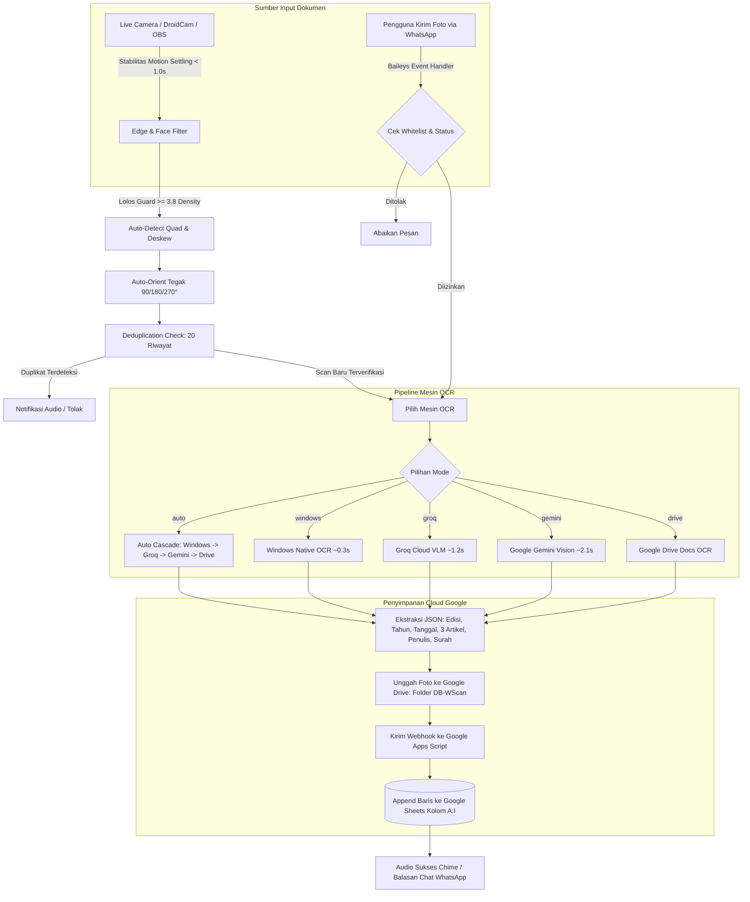

<div align="center">

# 📖 WScaner

### Automated Magazine OCR Scanner: Live Camera & WhatsApp Bot to Google Sheets

<p align="center">
  <a href="https://opencv.org/"></a>&nbsp;
  <a href="https://www.python.org/"></a>&nbsp;
  <a href="https://nodejs.org/"></a>&nbsp;
  <a href="https://github.com/WhiskeySockets/Baileys"></a>&nbsp;
  <a href="https://groq.com/"></a>&nbsp;
  <a href="https://ai.google.dev/"></a>&nbsp;
  <a href="https://developers.google.com/apps-script"></a>&nbsp;
  <a href="https://podman.io/"></a>
</p>

Sistem pemindai dokumen otomatis & cerdas untuk majalah/buletin dakwah **Ulul Albab - Cerdas dan Mencerahkan**. Mengekstrak metadata cover (*Edisi*, *Tahun Romawi*, *Tanggal/Bulan*), 3 Judul Artikel, Penulis, serta Surah Al-Qur'an menggunakan OCR berkecepatan tinggi, menyimpan foto bukti ke **Google Drive (`DB-WScan`)**, dan mencatat data terstruktur ke **Google Sheets**.

Mendukung input ganda: **Live Camera Auto-Scanner** (webcam / DroidCam / OBS Virtual Camera) dan **Bot WhatsApp Otomatis** (Baileys v7).

</div>

---

## 📑 Daftar Isi

- [🌟 Fitur Utama](#-fitur-utama)
- [🔄 Alur Pemrosesan (Workflow)](#-alur-pemrosesan-workflow)
- [⚡ Perbandingan 5 Mesin OCR](#-perbandingan-5-mesin-ocr)
- [📹 Live Camera Auto-Scanner](#-live-camera-auto-scanner)
  - [Hardware: DroidCam & OBS Virtual Camera](#hardware-droidcam--obs-virtual-camera)
  - [Pilihan Mode Batas (Boundary Modes)](#pilihan-mode-batas-boundary-modes)
  - [Rotasi & Auto-Orientation Cerdas](#rotasi--auto-orientation-cerdas)
  - [Tabel Pintasan Keyboard (Hotkeys)](#tabel-pintasan-keyboard-hotkeys)
  - [Parameter Baris Perintah (CLI Options)](#parameter-baris-perintah-cli-options)
- [📁 Struktur Proyek (Modular & Terorganisir)](#-struktur-proyek-modular--terorganisir)
- [⚙️ Variabel Lingkungan (`.env`)](#️-variabel-lingkungan-env)
- [🚀 Cara Menjalankan](#-cara-menjalankan)
- [💬 Perintah WhatsApp Bot](#-perintah-whatsapp-bot)
- [☁️ Integrasi Google Apps Script & Google Sheets](#️-integrasi-google-apps-script--google-sheets)
- [🧹 Pembersihan & Normalisasi Data Google Sheets](#-pembersihan--normalisasi-data-google-sheets)
- [🧪 Pengujian & Benchmarking](#-pengujian--benchmarking)

---

## 🌟 Fitur Utama

- **Live Camera Auto-Scanner Real-Time (`camera.bat` / `npm run camera`)**  
  Pemindai dokumen desktop berbasis OpenCV dengan visual HUD modern berkecepatan **30 FPS**. Mendeteksi stabilitas dokumen secara otomatis (*motion settling* ~1.0 detik) untuk memicu pemindaian tanpa perlu menekan tombol.
- **3 Mode Batas Fleksibel (`[B]`) & Perspective Deskewing**  
  - **`auto`**: Deteksi kontur 4 sudut dokumen secara real-time (*Canny Edge + Convex Hull PolyDP*) dengan peredam getar (*QuadTracker EMA*), lalu melakukan pelurusan sudut perspektif otomatis (*4-point perspective transform*).
  - **`full`**: Memindai seluruh frame kamera (sangat ideal untuk setup HP via DroidCam jarak dekat yang memenuhi layar).
  - **`box`**: Kotak panduan tengah standar cover majalah.
- **Auto-Orientation & Upright Correction**  
  Algoritma rotasi otomatis (`auto_orient_cv2`) mendeteksi orientasi teks dokumen dan memutar frame 90°, 180°, atau 270° ke posisi tegak (*upright*) sebelum dieksekusi oleh mesin OCR.
- **Anti-Face & False-Positive Guard**  
  Filter densitas tepi Canny ($\ge 3.8$) dan klasifikasi biner VLM (`is_magazine: boolean`) menolak wajah manusia, dinding polos, atau watermark DroidCam sehingga tidak menghasilkan baris sampah ke Google Sheets.
- **Pencegahan Duplikasi Cerdas (Deduplication History)**  
  Menyimpan riwayat 20 scan terakhir (`runtime/camera_scan_history.json`). Membandingkan nomor edisi, tanggal, dan tanda tangan judul artikel untuk menolak upload ganda yang tidak disengaja.
- **5 Pilihan Mesin OCR Multi-Tier**  
  Mendukung Groq Cloud VLM (Qwen 3.8 27B), Google Gemini Flash Vision, Windows Native OCR (`Windows.Media.Ocr`), Google Drive Native OCR, dan mode Hybrid Auto.
- **Persistent OCR Daemon (Port 5005)**  
  Background worker HTTP server Python untuk integrasi bot WhatsApp seketika tanpa overhead *cold-start*.
- **Penyimpanan Otomatis ke Google Drive & Google Sheets**  
  Mengunggah foto cover asli beresolusi tinggi ke folder Google Drive `DB-WScan`, menghasilkan formula hyperlink formula `=HYPERLINK(url; "[Link]")`, dan mencatat 9 kolom metadata majalah secara konsisten.
- **API Google Apps Script Dua Arah (Bi-Directional)**  
  Mendukung aksi simpan data baru (`post_scan`), inspeksi/baca data (`get_sheet_data`), pembersihan massal in-place (`update_sheet_clean`), dan Drive OCR langsung. Kolom 10 (J) diproteksi penuh agar tidak tertimpa.
- **Bot WhatsApp Otomatis (Baileys v7)**  
  Mendengarkan kiriman gambar di ruang obrolan, mengekstrak media sekali lihat (*view-once*), dan mendukung pembatasan akses berbasis nomor whitelist (*Role-Based Access*).

---

## 🔄 Alur Pemrosesan (Workflow)



---

## ⚡ Perbandingan 5 Mesin OCR

| Peringkat | Mesin / Model                                    | Kecepatan Rata-rata | Akurasi Majalah |  Konsumsi RAM Laptop   |       Kuota / Biaya        |     Mode Offline      |
| :-------: | :----------------------------------------------- | :-----------------: | :-------------: | :--------------------: | :------------------------: | :-------------------: |
| 🥇 **#1** | **Groq Cloud VLM (`qwen/qwen3.8-27b`)**          |   **~1.2 detik**    |    **100%**     |  **0 MB** (Cloud LPU)  |    Gratis (7k token/m)     |         Tidak         |
| 🥈 **#2** | **Google Gemini Vision (`gemini-flash-latest`)** |     ~2.1 detik      |    **100%**     |  **0 MB** (Cloud AI)   | Gratis (15 RPM / 1.5k RPD) |         Tidak         |
| 🥉 **#3** | **Windows Native OCR (`Windows.Media.Ocr`)**     |   **~0.3 detik**    |      ~85%       | **~15 MB** (Native C#) |        Tak Terbatas        | **Ya (100% Offline)** |
|  **#4**   | **Google Drive Native OCR (Google Docs)**        |     ~3.5 detik      |      ~80%       | **0 MB** (Cloud Docs)  |     Kuota Google Drive     |         Tidak         |
|  **#5**   | **Tesseract OCR (Lokal Linux / Container)**      |     ~2.5 detik      |      ~65%       |     ~150 - 300 MB      |        Tak Terbatas        |   **Ya (Offline)**    |

> [!TIP]
> Gunakan mode default **`auto`** (`OCR_ENGINE=auto`): sistem memindai dengan Windows OCR berkecepatan sub-detik untuk teks standar, dan secara otomatis beralih (*fallback*) ke Groq Cloud VLM jika teks miring, kontras rendah, atau resolusi kamera terbatas.

---

## 📹 Live Camera Auto-Scanner

Modul pemindai kamera langsung terletak pada subpaket modular `src/ocr/camera/` dan dapat dijalankan secara instan dengan klik ganda [`camera.bat`](camera.bat) atau melalui terminal:

```cmd
camera.bat
```

Atau menggunakan npm:
```bash
npm run camera
```

### Hardware: DroidCam & OBS Virtual Camera

Bagi pengguna yang memanfaatkan kamera smartphone untuk resolusi tinggi melalui **DroidCam** atau **OBS Virtual Camera**:

1. **Pemilihan Index Kamera:**  
   Jika laptop memiliki webcam bawaan (`Camera 0`), DroidCam atau OBS Virtual Camera umumnya berada pada `Camera 1`. Jalankan langsung:
   ```cmd
   camera.bat --camera 1
   ```
   *(Jika tidak menyertakan argumen `--camera`, sistem akan menampilkan menu interaktif pemilihan kamera).*
2. **Kamera Posisi Vertikal / Jarak Dekat:**  
   Ketika smartphone diletakkan vertikal dan berjarak dekat dengan majalah, cover akan memenuhi seluruh frame kamera. Gunakan mode batas **`full`**:
   ```cmd
   camera.bat --camera 1 --boundary full
   ```
3. **Filter Watermark DroidCam:**  
   Teks watermark bawaan DroidCam ("*DroidCam...*") secara otomatis difilter oleh parser teks dan tidak akan mengotori judul artikel maupun penulis.

### Pilihan Mode Batas (Boundary Modes)

Tekan tombol **`[B]`** pada keyboard saat jendela kamera aktif untuk berpindah mode secara berputar:

| Mode | Visual HUD | Keterangan & Penggunaan Terbaik |
| :--- | :--- | :--- |
| **`auto`** *(Default)* | Poligon Hijau / Kuning | **Deteksi kontur dokumen otomatis**. Sudut cover dilacak secara real-time dan dilakukan *4-point perspective unwarping* untuk meluruskan dokumen yang miring di atas meja. |
| **`full`** | Frame Penuh `[FULL-FRAME]` | **Seluruh layar kamera diambil**. Sangat cocok untuk kamera smartphone jarak dekat yang sudah pas membingkai majalah. |
| **`box`** | Kotak Sudut Tengah `[GUIDE-BOX]` | **Kotak panduan tetap di tengah frame**. Pengguna mengarahkan cover masuk ke dalam area kotak. |

### Rotasi & Auto-Orientation Cerdas

Modul `src/ocr/pipeline/orientation.py` memiliki fungsi `auto_orient_cv2`:
- Memeriksa rasio dimensi gambar dan mendeteksi orientasi horizontal baris teks.
- Apabila kamera smartphone terpasang terbalik atau menyamping (rotasi 90°, 180°, atau 270°), sistem secara otomatis memutar citra dokumen menjadi tegak lurus (*upright portrait*) sebelum diteruskan ke mesin OCR.

### Tabel Pintasan Keyboard (Hotkeys)

Saat jendela kamera `WScaner Live Camera Auto-Scanner` aktif:

| Tombol | Aksi | Keterangan |
| :---: | :--- | :--- |
| `[SPACE]` | **Foto Manual Seketika** | Memaksa proses pindaian langsung tanpa menunggu auto-settle 1 detik. |
| `[B]` | **Ganti Mode Batas** | Berpindah mode: `auto` ➔ `full` ➔ `box`. |
| `[R]` | **Ganti Resolusi Kamera** | Berpindah preset: `1080p` (1920x1080) ➔ `1440p / 2K` ➔ `720p`. |
| `[E]` | **Ganti Mesin OCR** | Berpindah engine: `Auto` ➔ `Windows` ➔ `Groq` ➔ `Gemini` ➔ `Drive`. |
| `[C]` | **Reset Riwayat Duplikasi** | Mengosongkan buffer riwayat 20 scan agar cover yang sama dapat dipindai ulang. |
| `[Q]` / `[ESC]` | **Keluar** | Menutup antarmuka kamera dan melepaskan perangkat capture. |

### Parameter Baris Perintah (CLI Options)

```text
Penggunaan: python src/ocr/live_camera.py [OPSI]

Opsi:
  -c, --camera INT       Index kamera hardware (contoh: 0, 1, 2)
  -r, --res PRESET       Resolusi kamera: 1080p (default), 720p, 1440p, 2k, 4k, max, atau WxH
  -b, --boundary MODE    Mode batas: auto (default), full, atau box
  -e, --engine NAMA      Mesin OCR: auto, windows, groq, gemini, drive
  --gas-url URL          Override URL Google Apps Script Webhook
  --clear-history        Bersihkan cache riwayat scan saat aplikasi dibuka
  -h, --help             Tampilkan pesan bantuan ini
```

Contoh eksekusi lengkap:
```cmd
python src/ocr/live_camera.py --camera 1 --res 1080p --boundary auto --engine auto
```

---

## 📁 Struktur Proyek (Modular & Terorganisir)

Struktur direktori dirancang dengan hierarki folder rapi maksimal 4 folder utama di root:

```text
WScaner/
│
├── 1. src/                               # Seluruh Kode Sumber Aplikasi
│   ├── bot/                              # Modul Node.js WhatsApp Bot (Baileys)
│   │   ├── bot.js                        # Entry point bot WhatsApp
│   │   ├── config.js                     # Pemuat konfigurasi .env & path
│   │   ├── whatsapp.js                   # Manajemen soket WhatsApp & QR Code
│   │   ├── messageHandler.js             # Filter pesan teks/media & balasan
│   │   ├── ocrRunner.js                  # Pemanggil OCR Python daemon/CLI
│   │   ├── ocrDaemon.js                  # Pengelola lifecycle worker daemon
│   │   ├── sessionLogger.js              # Pencatat statistik pindaian
│   │   ├── allowedNumbers.js             # Manajemen whitelist nomor WA
│   │   └── oneTimeUsed.js                # Ekstraktor foto sekali lihat
│   │
│   ├── ocr/                              # Modul Python Pemrosesan OCR & Kamera
│   │   ├── live_camera.py                # Wrapper eksekusi Live Camera Scanner
│   │   ├── server.py                     # HTTP OCR daemon server (Port 5005)
│   │   ├── ocr_processor.py              # Shim backward-compatible CLI pipeline
│   │   │
│   │   ├── camera/                       # Subpaket Live Camera Scanner
│   │   │   ├── scanner.py                # Loop capture, state, & background thread
│   │   │   ├── detection/
│   │   │   │   ├── document.py           # Deteksi kontur dokumen, QuadTracker & Deskew
│   │   │   │   └── motion.py             # Pendeteksi stabilitas gerak (motion settling)
│   │   │   ├── hardware/
│   │   │   │   └── capture.py            # Enumerasi kamera & manajemen resolusi MJPG
│   │   │   ├── history/
│   │   │   │   └── manager.py            # Buffer riwayat 20 scan & deteksi duplikasi
│   │   │   └── ui/
│   │   │       ├── hud.py                # Visual renderer HUD, gauge, dan status
│   │   │       └── audio.py              # Suara notifikasi Windows (winsound)
│   │   │
│   │   ├── engines/                      # Implementasi Independen Mesin OCR
│   │   │   ├── windows_engine.py         # Windows.Media.Ocr (Native C# Sub-detik)
│   │   │   ├── groq_engine.py            # Groq LPU Cloud Vision (qwen3.8-27b)
│   │   │   ├── gemini_engine.py          # Google Gemini Vision Flash
│   │   │   └── drive_engine.py           # Google Drive Native OCR
│   │   │
│   │   └── pipeline/                     # Alur Logika Pemrosesan & Integrasi
│   │       ├── processor.py              # Cascading fallback orchestrator
│   │       ├── parser.py                 # Ekstraksi regex kolom majalah & Surah
│   │       ├── orientation.py            # Deteksi rotasi otomatis & upright transform
│   │       └── gas_client.py             # Klien HTTP pengirim payload ke GAS
│   │
│   └── gas/                              # Google Apps Script Backend
│       ├── Kode.js                       # Handler Webhook doPost(), doGet() & Sheets API
│       └── appsscript.json               # Manifest konfigurasi V8 & OAuth scope
│
├── 2. data/                              # Dataset & Media Pindaian
│   ├── samples/                          # Gambar sampel majalah untuk pengujian
│   ├── scans/                            # Dataset terverifikasi & manifest.json
│   └── downloads/                        # Folder unduhan foto sekali lihat
│
├── 3. runtime/                           # State & Cache Sesi (Diabaikan Git)
│   ├── auth/                             # Kredensial login WhatsApp (Multi-device)
│   ├── logs/                             # Berkas log aktivitas harian
│   ├── temp/                             # Berkas capture sementara
│   └── camera_scan_history.json          # Cache riwayat pindaian kamera live
│
├── 4. scripts/                           # Skrip Pemeliharaan, Benchmarking & Migrasi
│   ├── clean_sheet_data.py               # Skrip pembersih & normalisasi data Sheets
│   ├── verify_cleaned_sheet.py           # Skrip verifikasi integritas 64 baris Sheet
│   ├── inspect_full_sheet.py             # Alat inspeksi struktur & formula Sheet
│   ├── populate_sheet.py                 # Pengisi massal data sampel ke Sheets
│   ├── test_tuned_ocr.py                 # Benchmark akurasi seluruh dataset
│   └── downloadDriveScans.js             # Pengunduh dataset dari folder Google Drive
│
└── bin/windows/                          # Skrip Eksekusi Praktis Windows
    ├── camera.bat                        # Launcher Live Camera Scanner
    ├── start.bat                         # Menu interaktif mesin OCR & bot WA
    ├── scan.bat                          # Utilitas scan instan dari terminal
    └── onetime.bat                       # Pengambil foto sekali lihat
```

---

## ⚙️ Variabel Lingkungan (`.env`)

Buat file `.env` di direktori utama (atau salin dari `.env.example`):

| Variabel | Tipe | Wajib | Keterangan & Nilai Default |
| :--- | :---: | :---: | :--- |
| `ALLOWED_NUMBER` | String | Ya | Nomor WhatsApp admin IT (format: `628xxxxxxxxxx` tanpa `+` atau spasi). |
| `START_COMMAND` | String | Tidak | Perintah aktivasi bot (default: `#start`). |
| `STOP_COMMAND` | String | Tidak | Perintah nonaktivasi bot (default: `#stop`). |
| `STATUS_COMMAND` | String | Tidak | Perintah cek status bot (default: `#status`). |
| `LOG_COMMAND` | String | Tidak | Perintah cek log aktivitas (default: `#log`). |
| `LINK_COMMAND` | String | Tidak | Perintah minta tautan spreadsheet (default: `#link`). |
| `TUTO_COMMAND` | String | Tidak | Perintah panduan penggunaan (default: `#tuto`). |
| `SPREADSHEET_URL` | String | Ya | URL lengkap dokumen Google Sheets tujuan. |
| `GAS_WEBHOOK_URL` | String | Ya | URL Web App Google Apps Script (berakhiran `/exec`). |
| `GAS_SECRET_TOKEN` | String | Tidak | Token rahasia otentikasi ke Web App GAS (disarankan). |
| `OCR_ENGINE` | Enum | Tidak | Pilihan default: `auto`, `windows`, `groq`, `gemini`, `drive` (default: `auto`). |
| `GROQ_API_KEY` | String | Kondisional | API Key dari [console.groq.com](https://console.groq.com/). Wajib jika memakai Groq. |
| `GROQ_MODEL` | String | Tidak | Model Groq Vision (default: `qwen/qwen3.8-27b`). |
| `GEMINI_API_KEY` | String | Kondisional | API Key dari Google AI Studio. Wajib jika memakai Gemini. |
| `GEMINI_MODEL` | String | Tidak | Model Gemini Vision (default: `gemini-flash-latest`). |
| `OCR_PORT` | Number | Tidak | Port background daemon server (default: `5005`). |

---

## 🚀 Cara Menjalankan

### Opsi 1: File Batch 1-Klik (Windows — Sangat Direkomendasikan)

Tersedia file batch praktis di direktori root:

1. **[`camera.bat`](camera.bat)**  
   Membuka antarmuka Live Camera Auto-Scanner langsung di resolusi Full HD 1080p.
   ```cmd
   camera.bat
   ```
2. **[`start.bat`](start.bat)**  
   Menampilkan menu interaktif pilihan mesin OCR dan langsung menyalakan bot WhatsApp beserta background worker Python.
3. **[`scan.bat`](scan.bat)**  
   Menjalankan pemindaian satu gambar langsung dari baris perintah:
   ```cmd
   scan.bat data/samples/Example0.jpg.jpeg --groq
   ```
4. **[`onetime.bat`](onetime.bat)**  
   Mengaktifkan mode ekstraksi foto sekali lihat (*view-once*) dan menyimpannya ke `data/downloads/`.

---

### Opsi 2: Menjalankan via Terminal (CLI)

1. **Instal seluruh dependensi:**
   ```bash
   npm install
   pip install -r requirements.txt
   ```
2. **Jalankan Bot WhatsApp:**
   ```bash
   npm start
   ```
3. **Pindai QR Code:**  
   Buka WhatsApp di ponsel ➔ **Pengaturan** ➔ **Perangkat Tertaut** ➔ **Tautkan Perangkat**, lalu arahkan kamera ponsel ke QR Code terminal.

---

### Opsi 3: Menjalankan via Container (Docker / Podman)

Proyek ini telah dilengkapi dengan `Dockerfile` dan `docker-compose.yml` multi-runtime:

```bash
# Menggunakan Podman (Klik ganda start-podman.bat atau jalankan):
podman machine start
npm run podman:up
npm run podman:logs

# Atau menggunakan Docker:
npm run docker:up
npm run docker:logs
npm run docker:down
```

---

## 💬 Perintah WhatsApp Bot

| Perintah | Hak Akses | Deskripsi |
| :--- | :---: | :--- |
| `#start` | IT Admin & Whitelist | Mengaktifkan bot untuk menerima pindaian cover majalah. |
| `#stop` | IT Admin & Whitelist | Menonaktifkan sementara penerimaan pindaian. |
| `#status` | Semua | Menampilkan status bot, mesin OCR aktif, dan uptime. |
| `#link` | Semua | Mengirimkan tautan langsung ke Google Spreadsheet tujuan. |
| `#tuto` | Semua | Mengirimkan panduan posisi pengambilan foto cover yang benar. |
| `#log` | IT Admin | Mengirimkan statistik pemindaian dan riwayat sesi. |
| `#add <nomor>` | IT Admin | Menambahkan nomor WhatsApp baru ke daftar whitelist. |
| `#rem <nomor>` | IT Admin | Menghapus nomor WhatsApp dari daftar whitelist. |
| `#list` | IT Admin | Menampilkan daftar seluruh nomor yang berhak memakai bot. |

---

## ☁️ Integrasi Google Apps Script & Google Sheets

Backend Google Apps Script (`src/gas/Kode.js`) bertindak sebagai gerbang aman antara klien pemindai dan Google Cloud (Spreadsheet & Drive).

### Struktur Google Sheets
- **Baris 1–4:** Judul, header tabel, dan metadata organisasi (dijaga tetap utuh).
- **Baris 5 ke bawah (`DATA_START_ROW = 5`):** Baris data pindaian.
- **Kolom 1–9 (A–I):**
  1. `No` (Nomor urut sekuensial)
  2. `TimeStamp` (Waktu scan: `YYYY-MM-DD HH:mm`)
  3. `Date` (Bulan & Tahun: contoh `April 2026`)
  4. `Tahun` (Tahun terbitan dalam angka Romawi: contoh `XI`)
  5. `Edition` (Nomor Edisi majalah)
  6. `Article` (Judul Artikel)
  7. `Author` (Nama Penulis Artikel)
  8. `Surah` (Surah Al-Qur'an rujukan)
  9. `Link` (Formula hyperlink bukti foto: `=HYPERLINK("https://drive.google.com/..."; "[Link]")`)
- **Kolom 10 (J):** Kolom terproteksi (*"JANGAN DIRUBAH"*), dijaga agar tidak terhapus saat pembersihan massal.

### Aksi Webhook yang Didukung

| Aksi (`action`) | Metode | Parameter Utama | Deskripsi |
| :--- | :---: | :--- | :--- |
| *(Default scan)* | `POST` | `edition`, `articles`, `image_base64`, `secret` | Mengunggah foto ke folder `DB-WScan`, membuat hyperlink, dan mencatat baris baru. |
| `get_sheet_data` | `POST` / `GET` | `secret` | Mengambil seluruh baris data dari Baris 5 ke bawah (termasuk nilai teks dan formula hyperlink). |
| `update_sheet_clean` | `POST` | `rows`, `start_row`, `secret` | Membersihkan Kolom A:I mulai Baris 5 dan menulis ulang baris yang telah dinormalisasi secara in-place. |
| `ocr_drive` | `POST` | `image_base64`, `file_id`, `secret` | Menjalankan OCR dokumen asli bawaan Google Drive API. |
| `list_drive` | `POST` / `GET` | `folder_id`, `secret` | Menampilkan daftar berkas di folder Drive `DB-WScan`. |
| `clear_data` | `POST` | `secret` | Mengosongkan seluruh baris data mulai Baris 5 ke bawah (tanpa menyentuh Kolom J). |

### Manajemen Kode GAS (Clasp)

```bash
# Memeriksa file yang dilacak oleh Clasp:
npx @google/clasp status

# Melakukan deploy / upload kode ke Google Apps Script:
npx @google/clasp push -f
```

---

## 🧹 Pembersihan & Normalisasi Data Google Sheets

Tersedia skrip pemeliharaan otomatis di folder `scripts/` untuk merapikan dataset yang telah tercatat di Google Sheets:

### 1. Menjalankan Uji Coba Pembersihan (Dry Run)
Menganalisis baris yang ada di Google Sheets, mendeteksi baris uji coba/dummy (seperti *"Artikel Tidak Terbaca"* atau *"Artikel 1, Penulis 1"*), menormalisasi format tanggal Indonesia, memperbaiki nomor urut, dan memeriksa formula tanpa mengubah data langsung:
```bash
python scripts/clean_sheet_data.py
```

### 2. Menerapkan Pembersihan Langsung ke Google Sheets
Menghapus baris dummy, merapikan ejaan judul/penulis, mengurutkan nomor 1..N secara sekuensial, dan menulis ulang baris ke Google Sheets secara *in-place*:
```bash
python scripts/clean_sheet_data.py --apply
```

### 3. Memverifikasi Integritas Data Sheet
Menjalankan uji otomatis untuk memastikan 100% data bersih, nomor urut konsisten, dan seluruh tautan Google Drive tetap berfungsi:
```bash
python scripts/verify_cleaned_sheet.py
```

---

## 🧪 Pengujian & Benchmarking

Gunakan perintah pengujian berikut untuk memvalidasi fungsi aplikasi secara lokal:

```bash
# Uji satu contoh pindaian cover menggunakan CLI:
npm run test:ocr

# Uji akurasi seluruh 13 dataset pindaian cover majalah:
python scripts/test_tuned_ocr.py

# Kirim seluruh pindaian dataset terverifikasi ke Google Sheets:
python scripts/populate_sheet.py

# Inspeksi seluruh isi sel dan formula di Google Sheets:
python scripts/inspect_full_sheet.py
```

---

<div align="center">

Dibuat dengan dedikasi untuk Majalah Dakwah **Ulul Albab** • Powered by DeepMind & Google Cloud Technology

</div>
